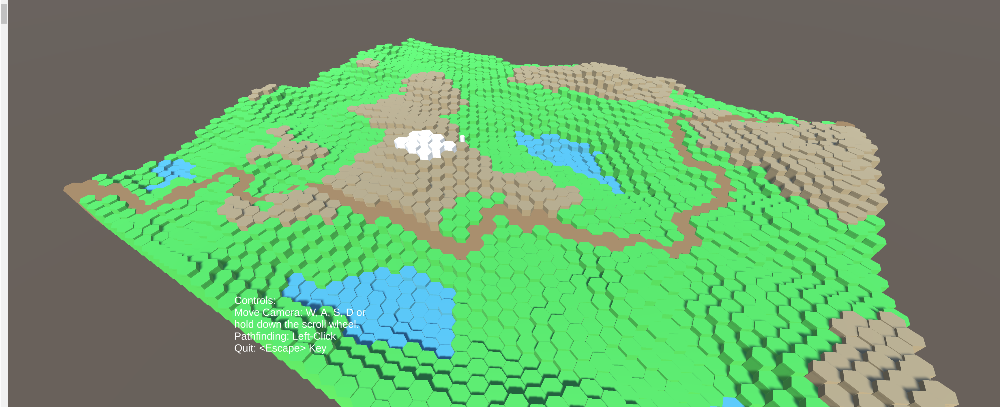

# Pathfinding

Pathfinding on a Hexagon Grid map. The map is procedually generated with the help of perlin noise.
Closest Path Calculation takes Height Difference into account.

Built using Unity3D Engine and C#.

To try this out on windows x86_64, download this repo and run the 'Pathfinding.exe' file in the 'Build' folder.

